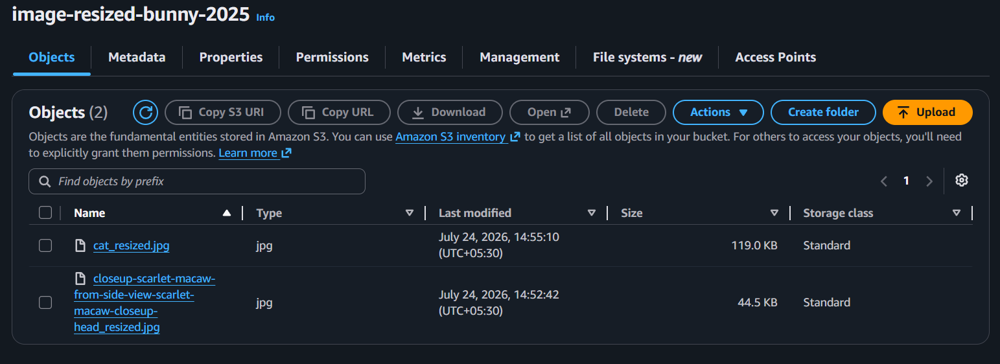
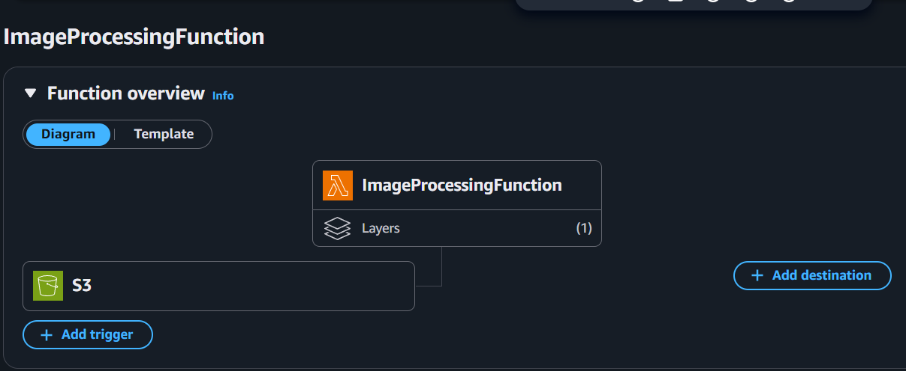
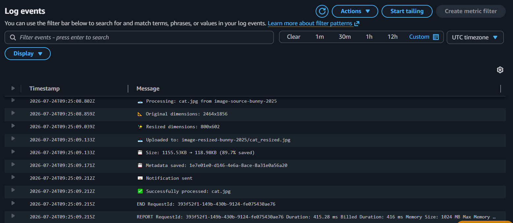
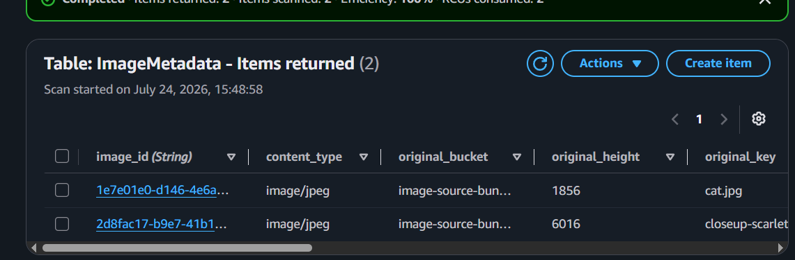
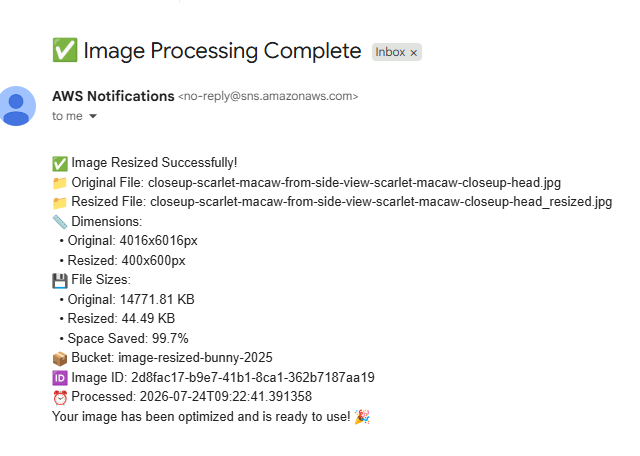

# Serverless Image Processing Pipeline on AWS

An event-driven, serverless pipeline that automatically resizes and optimizes images on upload, tracks metadata for analytics, and sends real-time processing notifications — with zero servers to manage.

## Overview

This project automates what would otherwise be a manual, repetitive task: resizing and optimizing images for storage and delivery. When an image lands in an S3 bucket, the pipeline detects the upload, resizes it while preserving aspect ratio, compresses it, records metadata about the transformation, and notifies stakeholders — all without a single running server.

It's designed the way a production system would be: least-privilege IAM, encryption at rest, cost-aware storage lifecycle rules, and CloudWatch-based monitoring and alerting.


## Architecture


```

**Flow:** S3 upload event → Lambda trigger → image resized with Pillow → resized file written to a separate output bucket → processing metadata written to DynamoDB → success/failure notification published to SNS (email + optional Slack webhook).

## Key Features

- **Automatic resizing** on upload, with aspect ratio preserved
- **File size optimization** — typically 40–70% smaller than the original
- **Metadata tracking** in DynamoDB (dimensions, sizes, timestamps, compression ratio) for analytics
- **Real-time notifications** via email and Slack on both success and failure
- **Fully event-driven** — no polling, no idle compute, no servers
- **Scales automatically** from a single image to high-volume concurrent uploads
- **Least-privilege IAM policies** scoped to specific buckets, table, and topic (not `*FullAccess`)
- **Encryption at rest** on both S3 buckets and the DynamoDB table
- **Cost controls** — S3 lifecycle rules to tier older originals to Infrequent Access/Glacier, DynamoDB TTL to expire old metadata, and CloudWatch billing alarms

## Tech Stack

| Service | Role |
|---|---|
| **AWS Lambda** (Python 3.11) | Core compute — image resizing and orchestration |
| **Pillow (PIL)** | Image processing, packaged as a Lambda layer |
| **Amazon S3** | Source bucket (uploads) and destination bucket (processed images) |
| **Amazon DynamoDB** | On-demand table storing per-image processing metadata |
| **Amazon SNS** | Fan-out notifications (email, Slack via webhook) |
| **Amazon CloudWatch** | Logs, dashboards, and alarms (errors, duration, cost) |
| **IAM** | Scoped execution role for the Lambda function |

## How It Works

1. A user (or application) uploads an image to the **source S3 bucket**.
2. The upload event triggers the **image-processing Lambda function**.
3. Lambda downloads the original, opens it with **Pillow**, and resizes it to a configurable max width/height while preserving aspect ratio.
4. The resized image is written to a **separate destination bucket** — this keeps source and processed assets cleanly separated and avoids re-triggering the same function in a loop.
5. Processing metadata (original/resized dimensions, file sizes, compression ratio, timestamp) is written to **DynamoDB**.
6. A formatted summary is published to an **SNS topic**, fanning out to email and, optionally, a Slack channel.
7. A secondary **monitoring Lambda** can run on a schedule to summarize daily throughput and estimated cost.

## Cost Profile

Processing 10,000 images per month costs roughly **$5–6** across Lambda, S3, DynamoDB, and SNS combined — compared to $30–50/month for an always-on EC2 instance, before accounting for the operational overhead of patching and scaling that instance manually.

## Security

- IAM execution role scoped to the exact S3 buckets, DynamoDB table, and SNS topic used by this pipeline — no wildcard `FullAccess` policies
- Server-side encryption enabled on both S3 buckets
- DynamoDB encryption at rest
- Bucket policies deny any non-HTTPS (`aws:SecureTransport: false`) requests
- CloudTrail enabled for API-level audit logging

## Monitoring

- CloudWatch dashboard tracking Lambda invocations, errors, and duration, plus S3 object counts
- Alarms on elevated Lambda error rate and processing duration
- AWS Budgets alert to catch unexpected cost spikes


## What This Project Demonstrates

- Designing event-driven serverless architectures on AWS (S3 → Lambda → DynamoDB/SNS)
- Packaging third-party Python dependencies as Lambda layers
- Applying least-privilege IAM in practice, not just in theory
- Building in observability (CloudWatch dashboards/alarms) and cost controls (lifecycle policies, TTL, budgets) from the start
- Thinking about failure handling and notification design for operational visibility


## Screenshots

**S3 Source Bucket (original upload)**


**S3 Destination Bucket (resized/optimized output)**


**Lambda Function Configuration**


**CloudWatch Logs (successful invocation)**


**DynamoDB Metadata Record**


**SNS Email Notification**


**IAM policies**


