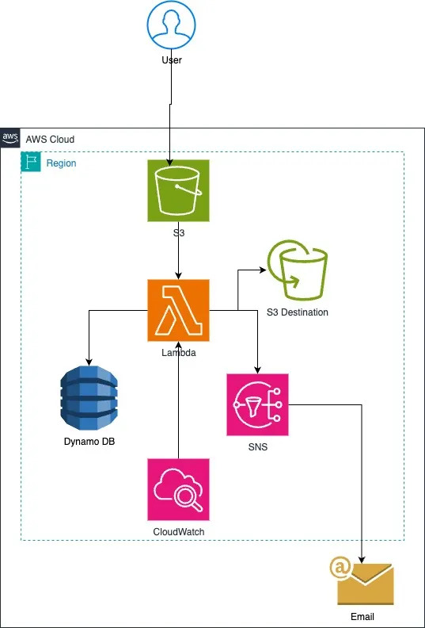

# Serverless Image Processing Pipeline on AWS

I built this to solve a problem I kept running into: images uploaded at full resolution eat up storage and slow down page loads, and manually resizing them just doesn't scale. So instead, this pipeline does it automatically — the moment an image lands in S3, it gets resized, compressed, logged, and someone gets notified. No server ever spins up to do it.

## What it does

Drop an image into an S3 bucket and this happens behind the scenes:

- It gets resized to a sensible max size while keeping its original aspect ratio
- The file size shrinks by roughly 40–70%, depending on the image
- The resized version lands in a separate output bucket
- Details about the transformation (original vs. resized dimensions, file sizes, timestamp) get saved to DynamoDB
- An email (and optionally a Slack message) goes out letting you know it's done — or if something failed

All of it runs on Lambda, so there's nothing to patch, scale, or babysit.

## Architecture

**The flow:** an image lands in the source S3 bucket → that upload triggers a Lambda function → Lambda resizes it with Pillow and writes the result to a second bucket → metadata about the whole process gets written to DynamoDB → SNS fires off a notification to email (and Slack, if you've wired it up).

## Tech Stack

| Service | What it's doing here |
|---|---|
| **AWS Lambda** (Python 3.11) | Runs the resizing logic — this is where the actual work happens |
| **Pillow (PIL)** | Handles the image processing, packaged as a Lambda layer |
| **Amazon S3** | One bucket for uploads, a separate one for processed output |
| **Amazon DynamoDB** | Stores metadata for every image that's been processed |
| **Amazon SNS** | Sends out notifications — email and Slack |
| **Amazon CloudWatch** | Logs, dashboards, and alarms so I can actually see what's happening |
| **IAM** | A scoped-down role so Lambda only has access to what it actually needs |

## How it works, step by step

1. Someone uploads an image to the source bucket.
2. That upload event triggers the Lambda function automatically.
3. Lambda pulls the image, opens it with Pillow, and resizes it — keeping the aspect ratio intact rather than stretching or cropping it.
4. The resized image gets written to a *different* bucket than the source. This was a deliberate choice — writing back to the same bucket would risk re-triggering the function in a loop.
5. Metadata about that image (dimensions before/after, file sizes, when it was processed) gets saved to DynamoDB.
6. SNS publishes a summary, which goes out to email and, if configured, Slack.
7. There's also a second, scheduled Lambda that puts together a daily summary of how much got processed and roughly what it cost.

## What it costs

Processing 10,000 images a month runs about **$5–6** total across Lambda, S3, DynamoDB, and SNS. For comparison, keeping a small EC2 instance running 24/7 just to do this would cost $30–50/month — and that's before factoring in the time spent patching and maintaining it.

## Security decisions I made

- The Lambda's IAM role only has access to the exact S3 buckets, DynamoDB table, and SNS topic it needs — no blanket `FullAccess` permissions
- Both S3 buckets have server-side encryption turned on
- DynamoDB is encrypted at rest
- Bucket policies reject any request that isn't over HTTPS
- CloudTrail is on, so every API call against these resources is logged

## Keeping an eye on it

- A CloudWatch dashboard tracks Lambda invocations, errors, and how long each run takes
- Alarms fire if the error rate climbs or processing starts taking too long
- An AWS budget alert flags anything that starts costing more than expected

## Why I built it this way

This wasn't just about getting resizing to work — I wanted to practice thinking like the systems I'd eventually be responsible for in a real job. That meant:

- Designing an event-driven pipeline instead of something that polls or runs on a schedule
- Packaging a third-party dependency (Pillow) as a Lambda layer rather than bundling it awkwardly into the function
- Actually locking down IAM permissions instead of leaving `FullAccess` policies in place
- Building in monitoring and cost guardrails from the start, not bolting them on later
- Thinking through what happens when something *fails*, not just when it succeeds